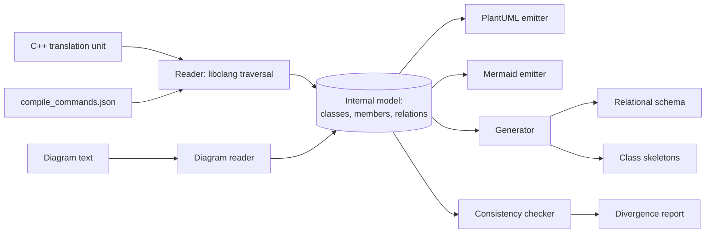

# Blueprint

Round-trip engineering between C++ source, UML class diagrams and relational schemas.
Course project for **UML Object-Oriented Design**, MEng in Computer and Software
Engineering, Faculty of Computer Systems and Technologies, Technical University of Sofia.

## What it is

Blueprint reads a C++ translation unit with the Clang frontend and builds a structural model
of it: classes, attributes, operations, visibility, scope, template parameters and the
relationships between classes. It emits that model as a UML class diagram in PlantUML and
Mermaid, derives a relational schema from classes marked for persistence, and works the other
way too, generating class skeletons and schema from a diagram. A consistency checker compares
a model extracted from code against a model read from a diagram and reports where the two have
drifted apart.

The problem it solves is ordinary and universal: the diagram stops matching the code within
days of being drawn, and nothing detects that.

## Goals

- Extract a UML class model from a C++ translation unit using semantic analysis, not text matching.
- Distinguish association, aggregation and composition by ownership of the member, not by guesswork.
- Emit the same model to two independent notations, so that the model is provably format-agnostic.
- Derive a relational schema from classes annotated with C++ attributes that map onto UML stereotypes and tagged values.
- Generate class declaration skeletons and schema DDL from a diagram.
- Report every difference between a model extracted from code and a model read from a diagram.

## Technologies

| Technology | Version / standard | Why |
| --- | --- | --- |
| C++ | ISO/IEC 14882:2020 (C++20) | Concepts and ranges keep the traversal code readable; the tool operates on C++, so staying in the language avoids a second toolchain. |
| libclang | LLVM stable, C API | The only option that gives resolved names, post-substitution types and ownership, which is what separates aggregation from composition. |
| CMake | 3.20 or newer | Produces the `compile_commands.json` the parser needs to open a translation unit with the project's real flags. |
| PlantUML | current language reference | Text notation, diffable, renders through existing renderers, covers UML class-diagram semantics closely. |
| Mermaid | current | Second emitter, and a check that the internal model is not shaped around one output format. |
| GoogleTest | 1.14 or newer | Standard for C++ unit tests, integrates with CTest without extra glue. |

## Architecture

The reader turns a translation unit into an internal model. The model is the only place
structure lives, and knows nothing about either the input language or the output formats.
Emitters turn the model into diagram text. The generator turns it into schema and skeletons.
The checker compares two models. Every dependency points at the model, so no emitter knows the
reader exists.



## Build

```bash
cmake -S . -B build -DCMAKE_BUILD_TYPE=Release -DCMAKE_EXPORT_COMPILE_COMMANDS=ON
cmake --build build -j

# tests
ctest --test-dir build --output-on-failure
```

Requires an LLVM installation with the libclang development headers, and CMake 3.20 or newer.

## Documentation

The project report lives in `docs/` and is written in Bulgarian, because the subject is taught
in Bulgarian and the layout is normative for the faculty. It follows the TU-Sofia FKST
formatting rules: A4, Times metrics at 12pt, 1.5 line spacing, Roman-numbered sections, tables
captioned above and figures below.

```bash
cd docs
latexmk -pdf Main.tex     # output: build/Main.pdf
```

Unfilled facts are marked with `\TODO{...}` and are found with:

```bash
grep -rn 'TODO' docs/chapters docs/Main.tex docs/references.bib
```

## Status

- [x] Repository scaffold
- [x] Report skeleton with all chapters and the bibliography
- [ ] Reader: libclang traversal into the internal model
- [ ] Relationship inference (association, aggregation, composition, dependency)
- [ ] Template classes and specializations
- [ ] PlantUML emitter
- [ ] Mermaid emitter
- [ ] Persistence annotations and relational schema generation
- [ ] Class skeleton generation from a diagram
- [ ] Diagram reader
- [ ] Consistency checker
- [ ] Unit tests
- [ ] Experiments run and results written up

Nothing under `src/`, `include/` or `tests/` is implemented yet.

## License

MIT. See [LICENSE](LICENSE).
